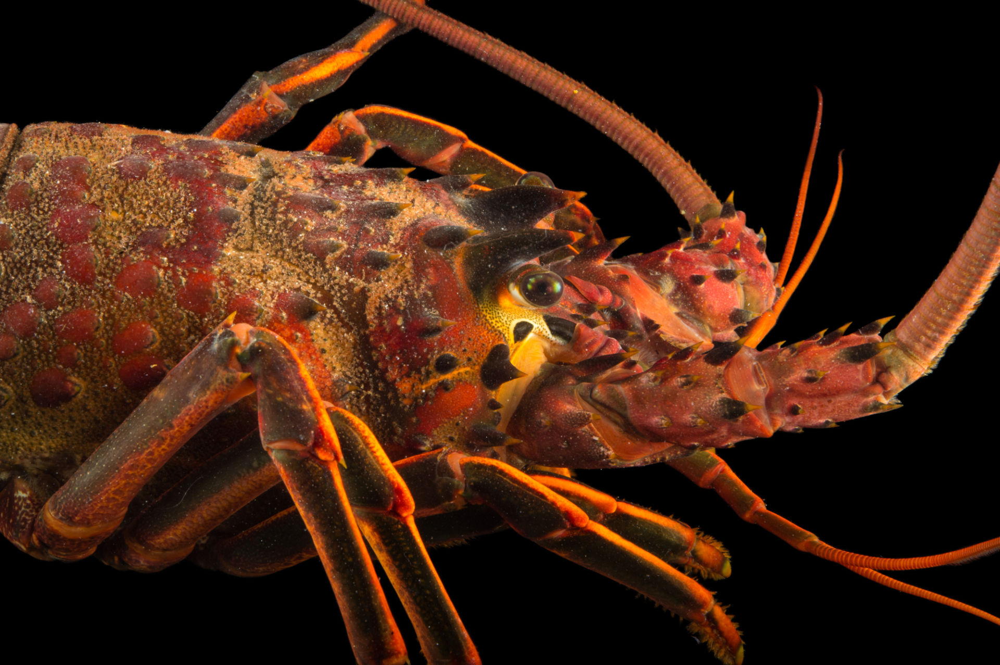

### Introduction

In 2012, the California Fish and Game Network of Marine Protected Areas (MPA) established two MPAs along the Santa Barbara coastline, one in Isla Vista and another in Naples. Like much of the Santa Barbara coastline, Isla Vista and Naples are home to the spiny lobster. The spiny lobster serves as an important predator in kelp forests off the California coastline. Since 2012, the Santa Barbara Coastal Long-Term Ecological Research program (SBC LTER) has collected annual data on the size and abundance of spiny lobsters from five sites along the Santa Barbara coastline. The SBC LTER data is collected from the two MPA sites mentioned above and three non-MPA sites along the Santa Barbara coastline, Mohawk, Arroyo Quemado, and Carpinteria. A comparison of the size and abundance of spiny lobsters between these five sites provides useful insight into the impact that MPAs have spiny lobster populations. This report uses the SBC LTER data to analyze the effect that MPAs have had on the size and abundance of spiny lobsters along the Santa Barbara coastline between 2012 and 2018. 



### Data and Methods

Data used for this study includes: 1) spiny lobster counts within designated transects at each site measured annually in late summer before the fishing season, and 2) the visually estimated sizes of these lobsters. Visualizations and statistics were used to identify interesting trends of these variables. T-tests were conducted to measure the significance of differences in mean lobster sizes and counts between Marine Protected Areas and non-Marine Protected Areas and also between 2012 and 2018 for each of those two groups. These tests were conducted at a 5% signficance level. Software used for this analysis includes R-Studio Version 1.2.1335 and GitHub.

### Part I

First, set echo to false. Make sure no messages are showing in final knitted document.


```{r setup, include = FALSE}
knitr::opts_chunk$set(echo = FALSE, message=FALSE, warning=FALSE)
```

```{r}

# install.packages("ggrepel")
# install.packages("plotly")


# ---------------------------
# Install & Attach Packages
# ---------------------------

library(tidyverse)
library(janitor)
library(directlabels)
library(DT)


# -----------------------------------
# Read-in & clean-up lobster data csv 
# -----------------------------------

lobster_abundance <- read_csv("lobster_abundance_sbc_lter.csv",
                              na = "-99999") %>%
  clean_names()

```

### In text (above or below the graph for Results A), describe general / interesting trends that you observe for lobster abundance at the 5 sites

```{r}
# --------------------------------
# Create data frame for ggplot
# --------------------------------

lobster_changes <- lobster_abundance %>%
  select(year, site, count) %>% 
  group_by(site, year) %>% 
  summarize(total_count = sum(count)) %>% 
  mutate(site_status = ifelse(site == "IVEE", "MPA",
         ifelse(site == "NAPL", "MPA", "Non-MPA"))) %>% 
  mutate(site_name = ifelse(site == "IVEE", "Isla Vista",
                            ifelse(site == "CARP", "Carpinteria",
                                   ifelse(site == "AQUE", "Arroyo Quemado", 
                                          ifelse(site == "NAPL", "Naples", "Mohawk")))))

```

```{r}
# ----------------------------
# Make a beautiful GGplot
# ----------------------------

ggplot(lobster_changes, aes(x = year, y = total_count, group = site))+
  geom_line(aes(color = site_status), size = 1.5)+
  geom_point(color = "gray35")+
  geom_dl(aes(label = site_name, color = site_status), method = list(dl.combine("last.points"), cex = 0.85))+
  scale_x_continuous(expand = c(0, 0),
                     limits = c(2012, 2019.25),
                     breaks = seq(2012, 2018, by = 1))+
  scale_y_continuous(limits = c(0, 1000),
                     expand = c(0,0),
                     breaks = seq(0, 1000, by = 250))+
    labs(color = "Marine Protected Area (MPA)",
         x = "Year",
         y = "Total Count",
         title = "Spiny Lobster Count by Year and Location (Segan & Vieborck)")+
  theme(legend.position = c(0.2, 0.8),
        legend.background = element_rect(fill = "gray75"),
        legend.key = element_rect(fill = "gray85"))

# ----------------------------------------
# **Add a figure caption below the graph**
# ----------------------------------------

```

##### Interesting trends:
- Isla Vista has seen the largest increase in spiny lobster count by far among the five locations analyzed
- Populations increased by well over 100% in Isla Vista and Carpenteria from 2016 - 2017
- Marine Protected Areas showed gradual increase in lobster counts following their protection status in January, 2012 but this did not persist for Naples
- Carpinteria (Non-MPA) and Isla Vista (MPA) were on similar trajectories between 2016 and 2017. Carpentiria, which is a non-MPA saw a major decline between 2017 and 2018, whereas Isla Vista, which is an MPA, did not. 
- Overall, Spiny Lobster counts have gone up over the past 6 years at these five locations (average? Arroyo)

###

### Part 2

### In text, describe general / interesting trends that you see in community size structure at different sites (again, considering MPA vs. non-MPA status) for lobsters between 2012 and 2018. 

```{r}

# --------------------------------------------------
# Create a GGplot with two box-plots side-by-side
# --------------------------------------------------

lobster_sizes <- lobster_abundance %>%
  uncount(count) %>% 
  select(size_mm, year, site) %>% 
  mutate(site_name = ifelse(site == "IVEE" & year == "2018", "MPA - Isla Vista (2018)",
                            ifelse(site == "IVEE" & year == "2012", "MPA - Isla Vista (2012)",
                                   ifelse(site == "NAPL" & year == "2018", "MPA - Naples (2018)",
                                          ifelse(site == "NAPL" & year == "2012", "MPA - Naples (2012)",
                                                 ifelse(site == "CARP" & year == "2018", "Carpinteria (2018)",
                                                        ifelse(site == "CARP" & year == "2012", "Carpinteria (2012)",
                                                               ifelse(site == "AQUE" & year == "2018", "Arroyo Quemado (2018)",
                                                                      ifelse(site == "AQUE" & year == "2012", "Arroyo Quemado (2012)",
                                                                             ifelse(site == "MOHK" & year == "2018", "Mohawk (2018)", "Mohawk (2012)"))))))))))
# GGPlot Time
                              
# ggplot(data = lobster_sizes, aes(x = site_name, y = size_mm, color = site_name, fill = site_name))+
#   geom_boxplot(show.legend = FALSE, alpha = 0.60)+
#   scale_color_manual(values = c("dodgerblue", "dodgerblue", "red", "red", "purple", "purple", "orange", "orange", "green", "green"))+
#   scale_fill_manual(values = c("dodgerblue", "dodgerblue", "red", "red", "purple", "purple", "orange", "orange", "green", "green"))+
#   labs(x = "Site Name",
#        y = "Spiny Lobster Size (mm)",
#        title = "Size Comparison (Segan & Viebrock")+
#   scale_x_discrete(labels = c(
#     "Isla Vista (2018)" = "IV '18",
#     "Isla Vista (2012)" = "IV '12",
#     "Naples (2018)" = "NPLS '18",
#     "Naples (2012)" = "NPLS '12",
#     "Carpinteria (2018)" = "CARP '18",
#     "Carpinteria (2012)" = "CARP '12",
#     "Arroyo Quemado (2018)" = "AQUE '18",
#     "Arroyo Quemado (2012)" = "AQUE '12",
#     "Mohawk (2018)" = "MOHK '18",
#     "Mohawk (2012)" = "MOHK '12"))+
#   theme_light()

# OR

ggplot(data = lobster_sizes, aes(x = site_name, y = size_mm, color = site_name, fill = site_name))+
  geom_boxplot(show.legend = FALSE, alpha = 0.60)+
  scale_color_manual(values = c("black", "black", "black", "black", "black", "black", "black", "black", "black", "black"))+
  scale_fill_manual(values = c("navy", "navy", "dodgerblue4", "dodgerblue4", "dodgerblue1", "dodgerblue2", "firebrick2", "firebrick1", "firebrick4", "firebrick4"))+
  labs(color = "Marine Protected Area (MPA)",
       x = "Site Name",
       y = "Spiny Lobster Size (mm)",
       title = "Comparison of Spiny Lobster Size Distributions: 2012 vs. 2018",
       caption = "Figure 2 HI Rich: Spread of lobster sizes for each of the five Santa Barbara coastline site for the years 2012 and 2018. Red colors are for Marine Protected Area sites while blue colors are for non-Marine Protected Area Sites. Change in median size from 2012-2018 for MPA was +13.5 mm while change in median size for non-MPA was -2 mm. Data: Santa Barbara Coastal Long-Term Ecological Research program")+
  theme_light()+
  coord_flip()

# ----------------------------------------
# **Add a figure caption below the graph**
# ----------------------------------------

```

##### Interesting trends in spiny lobster community size structure across locations:
- Marine Protected Areas (Naples and Isla Vista) saw very clear increases in median sizes from 2012 to 2018
- The spread of sizes noticibly decreased for Naples, Mohawk, and Carpenteria from 2012 - 2018, while it did not change at Arroyo Quemado and it increased at Isla Vista.

###

### Part 3

### In text in your report, describe the outcome of the statistical hypothesis tests using in-line referencing (e.g. do not copy and paste values from the output). Remember: the p-value is not enough. You should also describe more meaningful metrics for comparison. Here are some things you might consider including in your description: the actual differences in mean size between groups, % changes, measure of uncertainty (e.g. confidence interval), etc.

```{r}

# Part 3a
# Compare mean lobster sizes at MPA vs. non-MPA sites in 2012 and 2018

MPA_v_nonMPA <- lobster_abundance %>% 
  mutate(site_status = 
           ifelse(site == "IVEE", "MPA",
         ifelse(site == "NAPL", "MPA", "non-MPA"))) %>% 
  select(size_mm, year, site, count, site_status) %>% 
  uncount(count) %>% 
  filter(year %in% c("2012", "2018"))

# ------------------------
# Make different datasets
# ------------------------

MPA <- lobster_abundance %>% 
  filter(site %in% c("IVEE", "NAPL")) %>% 
  filter(year %in% c("2012", "2018")) %>% 
  uncount(count)

MPA_2018 <- MPA %>% 
  filter(year %in% c("2018"))

MPA_2012 <- MPA %>% 
  filter(year %in% c("2012"))

non_MPA <- lobster_abundance %>% 
  filter(site %in% c("CARP", "MOHK", "AQUE")) %>% 
  filter(year %in% c("2012", "2018")) %>% 
  uncount(count)

non_MPA_2018 <- non_MPA %>% 
  filter(year %in% c("2018"))

non_MPA_2012 <- non_MPA %>% 
  filter(year %in% c("2012"))

# t-test questions

# 1. For 2012 observations, is there a significant difference in lobster size between MPA and non-MPA sites? 

diff_size_2012 <- t.test(MPA_2012$size_mm, non_MPA_2012$size_mm)

# 2. For 2018 observations, is there a significant difference in lobster size between MPA and non-MPA sites? 

diff_size_2018 <- t.test(MPA_2018$size_mm, non_MPA_2018$size_mm)

# 3. For MPA sites only, is there a significant difference in lobsters observed in 2012 vs. 2018?

diff_size_MPA <- t.test(MPA_2012$size_mm, MPA_2018$size_mm)

# 4. For non-MPA sites only, is there a significant difference in lobsters observed in 2012 vs. 2018?

diff_size_non_MPA <- t.test(non_MPA_2012$size_mm, non_MPA_2018$size_mm)

```
#### Part C

##### Question 1:
Mean lobster size differed significantly between MPA and non-MPA sites in 2012 (t(`r round(diff_size_2012$parameter, 2)`) = `r round(diff_size_2012$statistic, 2)`, *p* < 0.05).

##### Question 2:
Mean lobster size differed significantly between MPA and non-MPA sites in 2018 (t(`r round(diff_size_2018$parameter, 2)`) = `r round(diff_size_2018$statistic, 2)`, *p* < 0.05).

##### Question 3:
Mean lobster size differed significantly between 2012 and 2018 for MPA sites (t(`r round(diff_size_MPA$parameter, 2)`) = `r round(diff_size_MPA$statistic, 2)`, *p* < 0.05).

##### Question 4:
Mean lobster size did *not* differ significantly between 2012 and 2018 for non-MPA sites (t(`r round(diff_size_non_MPA$parameter, 2)`) = `r round(diff_size_non_MPA$statistic, 2)`, *p* > 0.05).

###

```{r}
# Part 3b

lobster_table_data <- MPA_v_nonMPA %>%
  group_by(site_status, year) %>% 
  summarize(mean = mean(size_mm),
            standard_deviation = sd(size_mm),
            sample_size = n(),
            median(size_mm)) %>% 
  mutate_if(is.numeric, round, 2)

lobster_table <- datatable(lobster_table_data,
                           caption = "MPA vs. Non-MPA") %>% 
  formatStyle('site_status', color = 'black') %>% 
  formatStyle('year', color = 'black') %>% 
  formatStyle('mean', color = 'black') %>%
  formatStyle('standard_deviation', color = 'black') %>% 
  formatStyle('sample_size', color = 'black')

lobster_table

# ------------------------------------------------------------------------------
# Spruce up caption for this table & email about fixing the color-scale of table
# ------------------------------------------------------------------------------

```

### A brief summary of the major findings (pick 3 - 4) from your mini-report. A bullet-pointed list is fine, but the findings should be well-written, responsible (don’t overstate your findings), and refer to outcomes (e.g. figures, tables) in the Results section

### References (including for data sources & literature cited in your introduction) that were used to prepare the report. Reference formatting matters